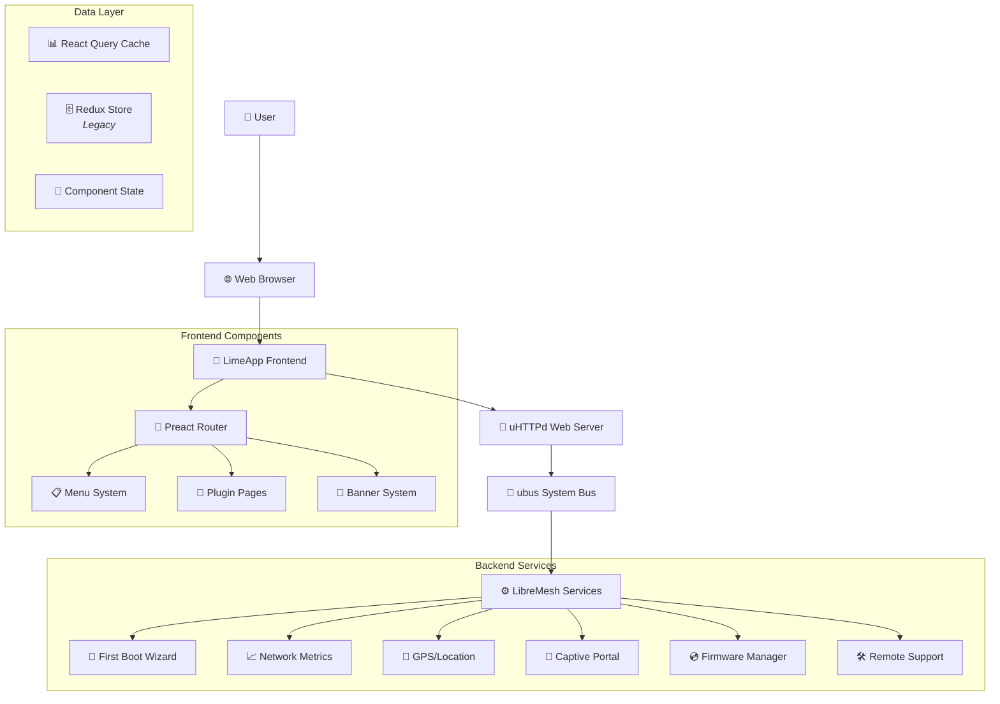
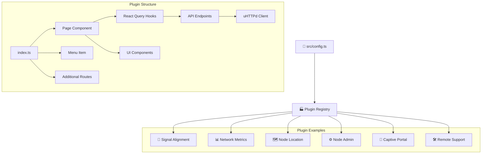
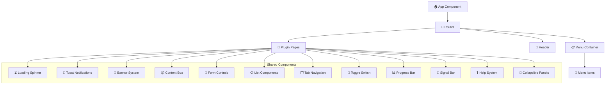
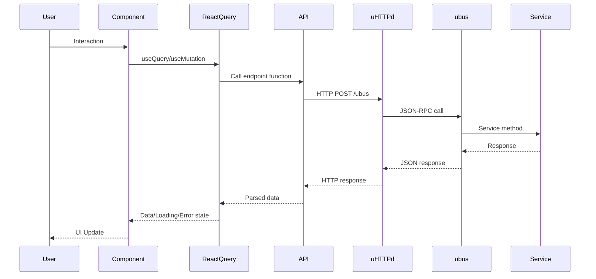
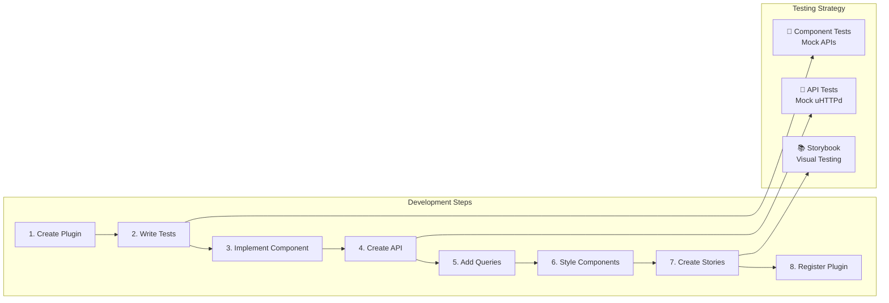
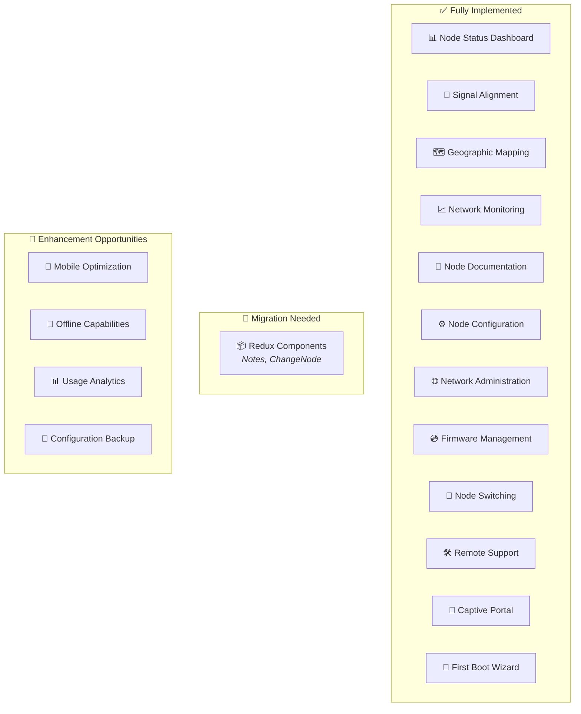
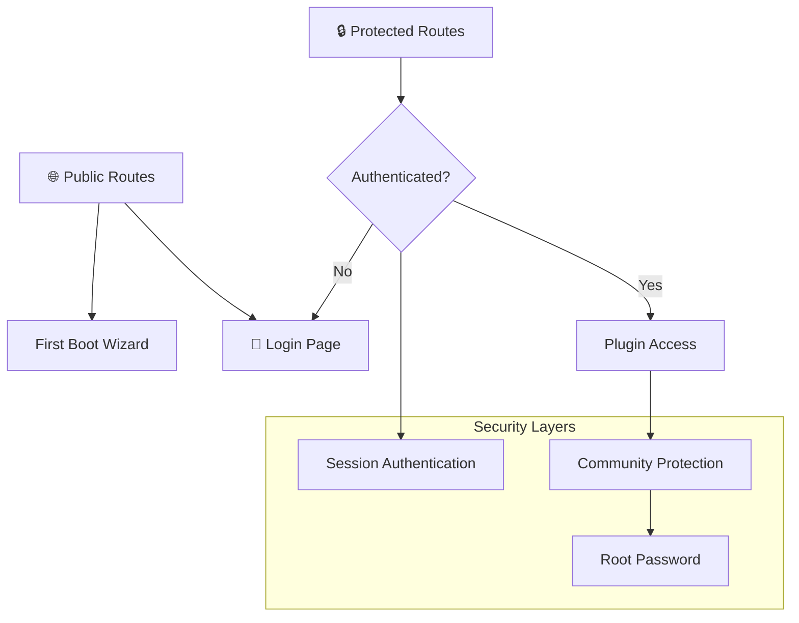
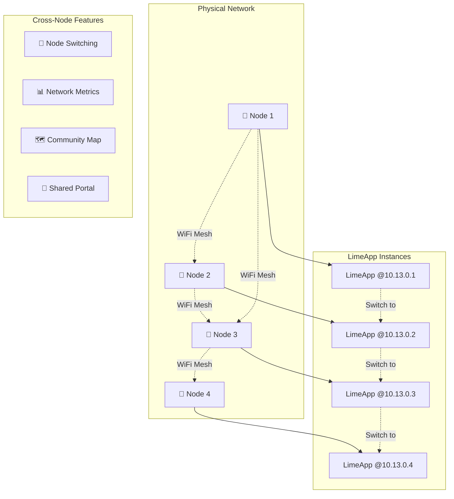
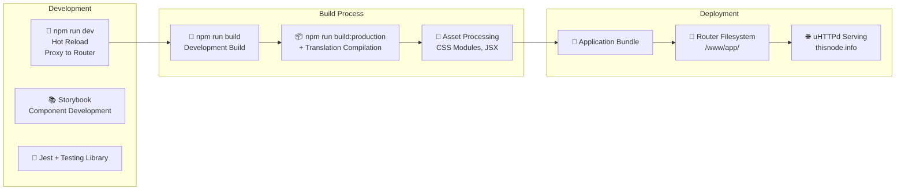

# LimeApp Project Flow Diagram

## High-Level System Architecture

## Plugin System Flow

## Component Hierarchy

## Data Flow Architecture

## Plugin Development Flow

## Feature Implementation Status Matrix

## Authentication & Security Flow

## Network Topology Integration

## Build & Deployment Pipeline

