# 🌊 Flujo de Datos Visual - LiMeApp

## 🎯 Diagrama Principal de Arquitectura

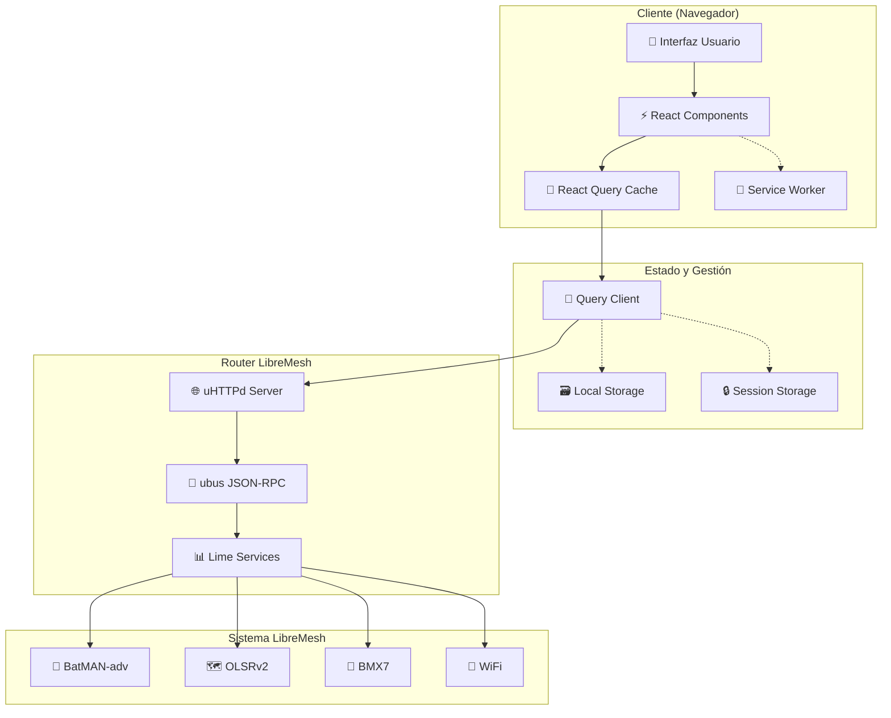

## 🔄 Flujo de Datos Detallado

### 1. 📱 Interacción del Usuario

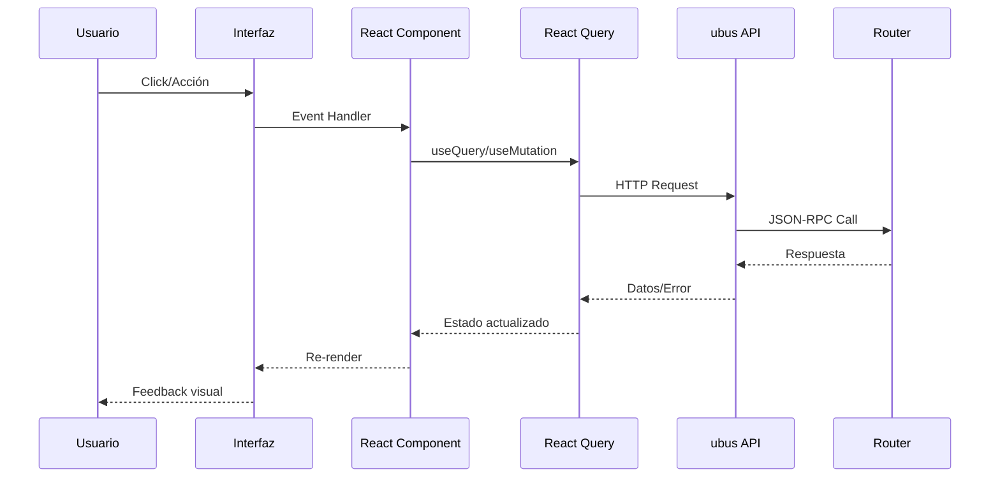

### 2. 🏗️ Arquitectura de Plugins

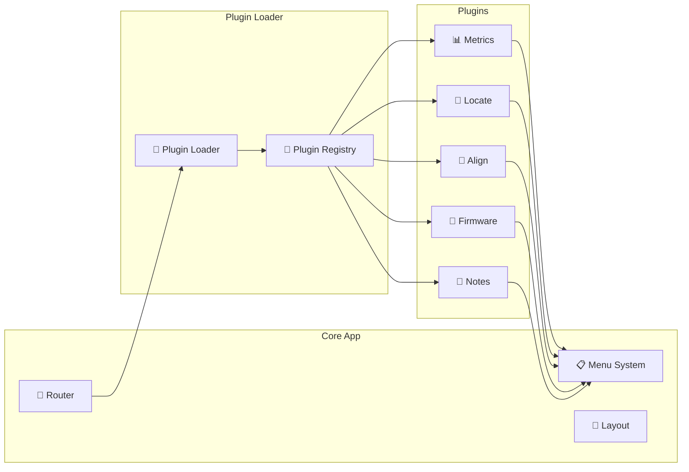

### 3. 💾 Gestión de Estado (React Query)

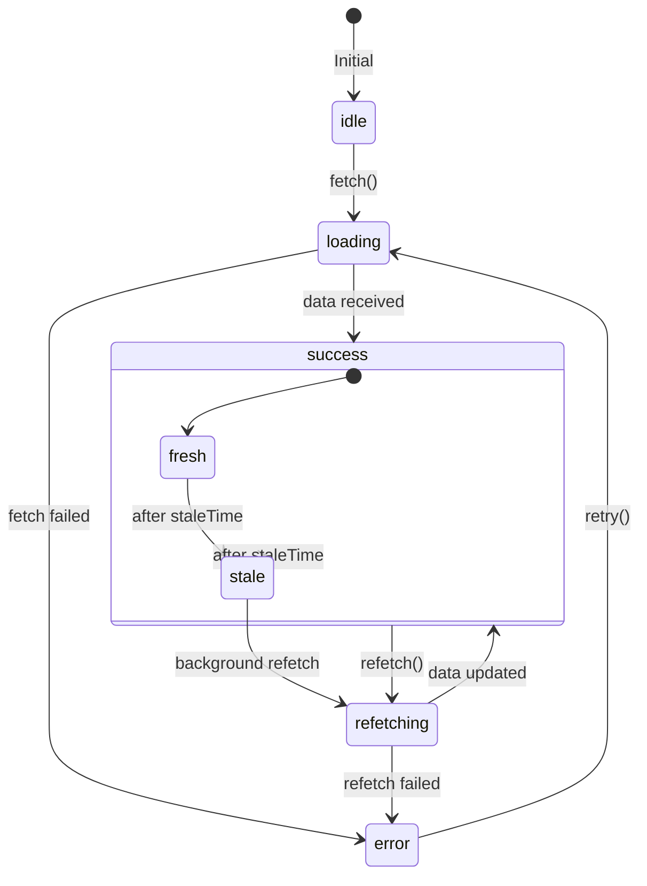

## 🌐 Comunicación con Router

### ubus JSON-RPC Protocol

```json
{
    "jsonrpc": "2.0",
    "id": 1,
    "method": "call",
    "params": [
        "session_id",
        "service_name",
        "method_name",
        { "param1": "value1" }
    ]
}
```

### Servicios LibreMesh Principales

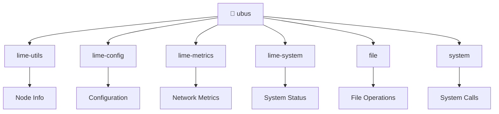

## 🧩 Flujo de Desarrollo Plugin

### Ciclo de Vida Plugin

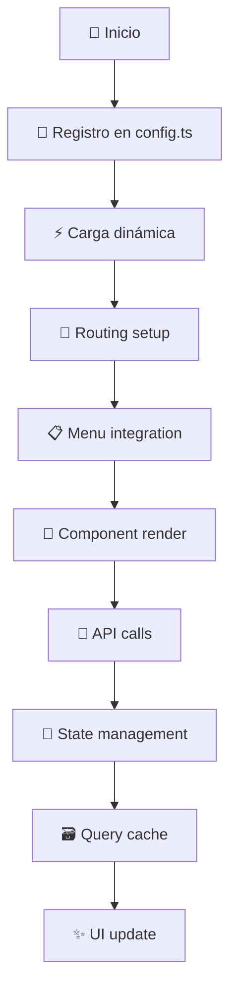

### Estructura Plugin Estándar

```
plugins/lime-plugin-example/
├── index.ts                 # Plugin registration
├── example.spec.js         # Component tests
├── example.stories.js      # Storybook stories
└── src/
    ├── ExamplePage.tsx     # Main component
    ├── ExampleMenu.tsx     # Menu component
    ├── ExampleApi.js       # API endpoints
    ├── ExampleQueries.js   # React Query hooks
    └── style.less          # Styles
```

## 🔄 Migration Path: Redux → React Query

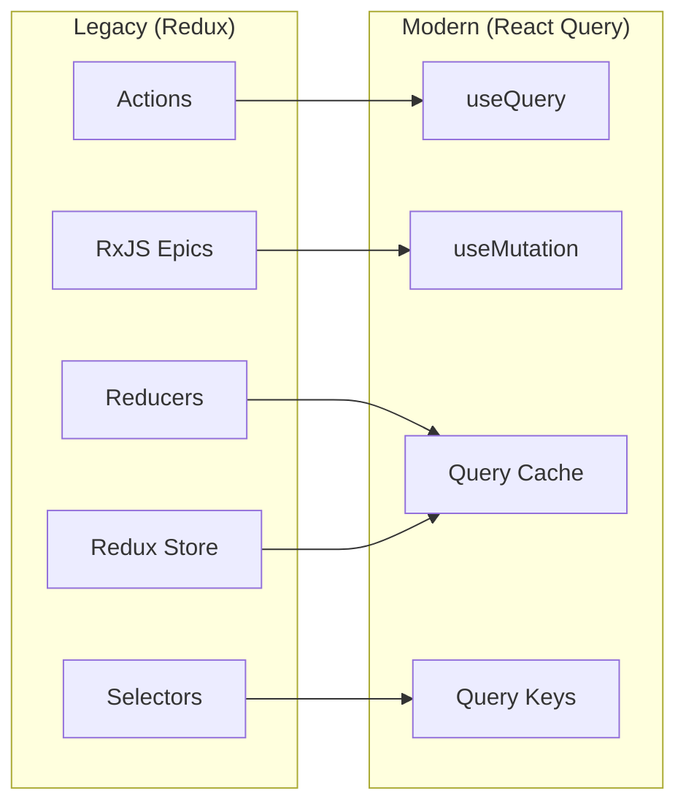

## 🧪 Testing Architecture

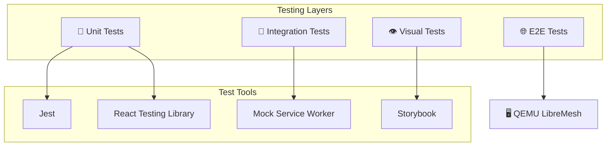

## 🚀 Performance Optimizations

### Bundle Optimization

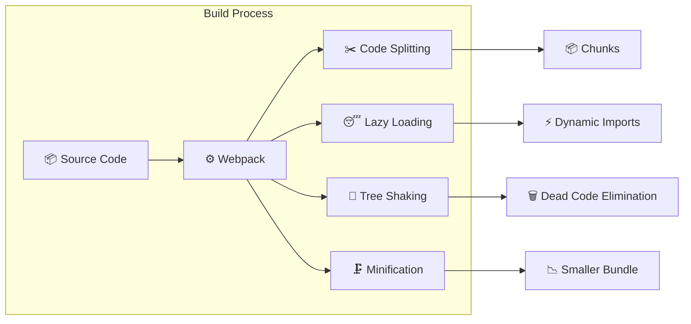

### Caching Strategy

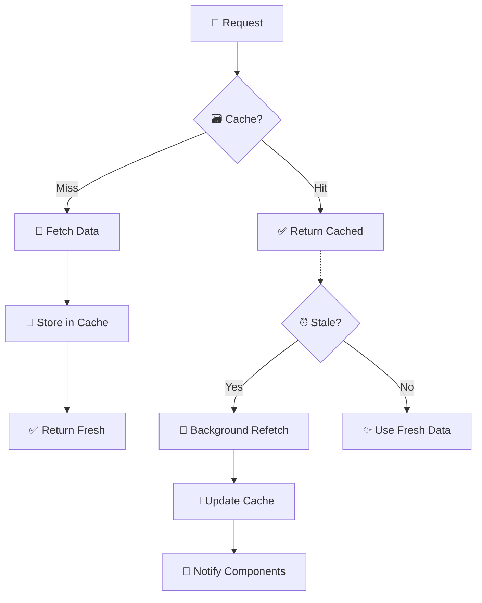

## 🌍 Internacionalización (i18n)

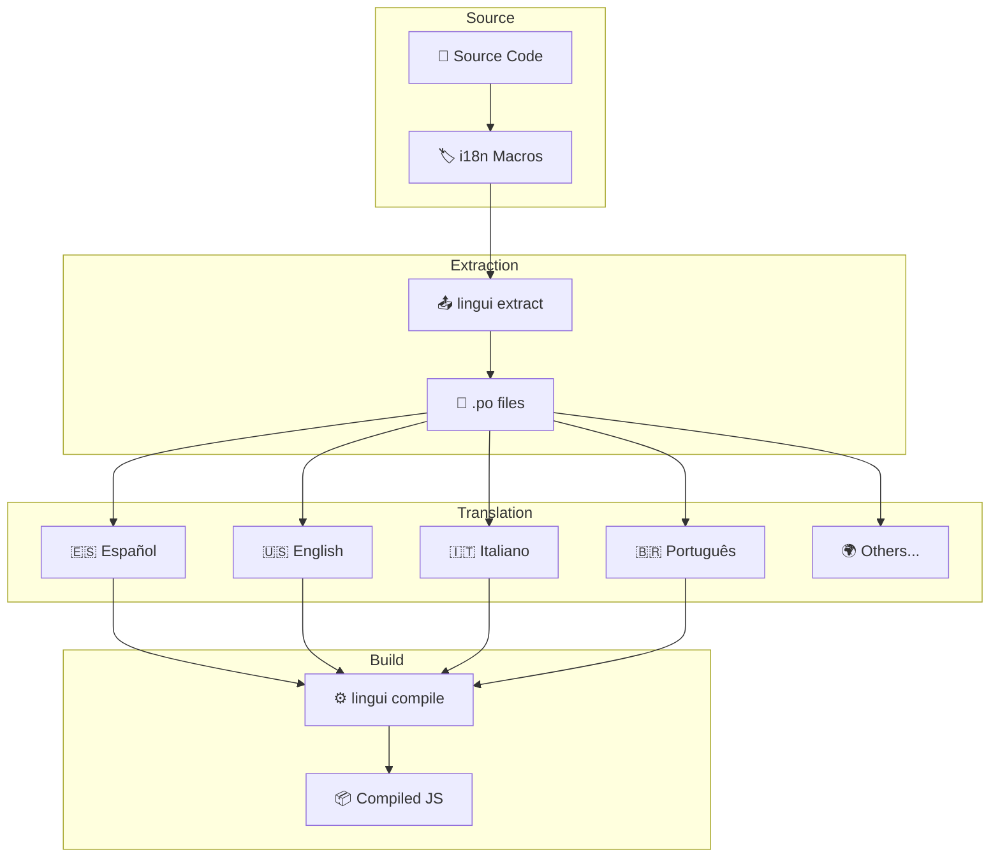

---

_Diagramas implementados con Mermaid.js para compatibilidad multiplataforma_
