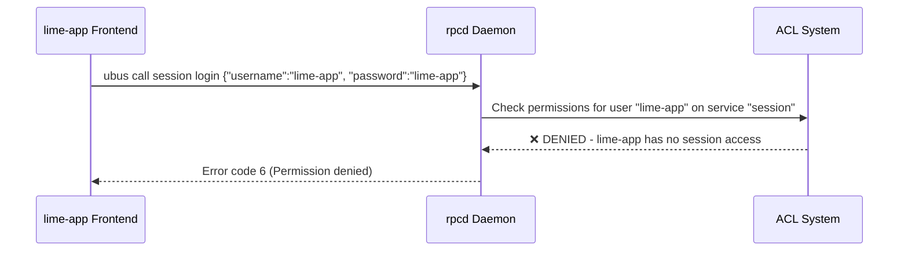
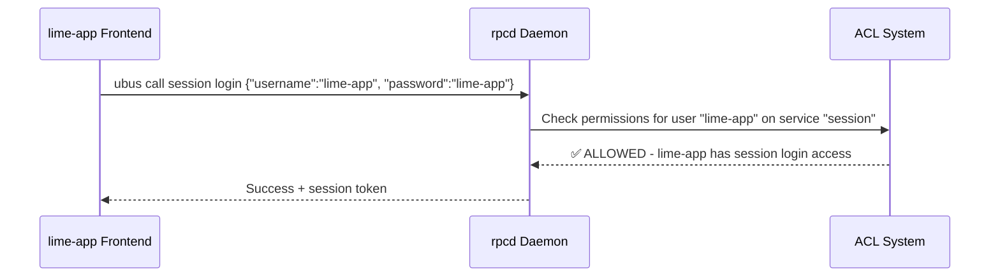

# ACL Authentication Analysis: lime-app User Login Issue

> **Estado**: ✅ **RESUELTO E IMPLEMENTADO**  
> **Fecha**: Julio 2025  
> **Contexto**: Análisis completo del sistema de autenticación ACL en LibreMesh/LibreRouterOS

## 🎯 Resumen Ejecutivo

### ✅ Problema Resuelto
El usuario `lime-app` fallaba consistentemente en autenticación con **error ubus código 6** (Permission denied), impidiendo el auto-login diseñado para acceso público sin contraseña.

### ✅ Causa Raíz Identificada
**Falla de diseño ACL**: El usuario lime-app requería acceso al servicio `session` para autenticarse, pero la configuración ACL no le otorgaba estos permisos, creando un catch-22 de autenticación.

### ✅ Solución Implementada y Desplegada
**Adición de permisos de sesión** al archivo ACL `lime-utils.json` en el paquete `ubus-lime-utils` de lime-packages.

**Estado actual:** Auto-login funcional en LibreMesh v4 con modelo de acceso dual (invitado/administrador).

---

## 📋 Análisis Técnico Detallado

### Arquitectura de Autenticación LibreMesh

LibreMesh utiliza un **sistema de doble capa** para control de acceso:

1. **RPCD User Configuration** (uci configurable)
   - Define usuarios y sus permisos generales (`read=*`, `write=*`)
   - Ubicación: `/etc/config/rpcd`

2. **ACL Files** (solo lectura en runtime)
   - Controla acceso granular a servicios ubus específicos
   - Ubicación: `/usr/share/rpcd/acl.d/*.json`
   - **Precedencia**: ACL files sobrescriben permisos RPCD

### Configuración ACL Problemática (Original)

**Archivo**: `/usr/share/rpcd/acl.d/lime-utils.json`

```json
{
    "lime-app": {
        "description": "lime-app public access",
        "read": {
            "ubus": {
                "lime-utils": [ "*" ],
                "system": [ "board" ]
            }
        },
        "write": {
            "ubus": {
                "lime-utils": [ "*" ]
            }
        }
    }
}
```

**⚠️ Problema**: Falta acceso al servicio `session`

### Flujo de Autenticación Fallido



### ¿Por Qué Solo root Funciona?

**root user configuration**:
```json
// En uci config
"read": ["*"],
"write": ["*"]

// En ACL - no hay restricciones específicas para root
// Por lo tanto root tiene acceso completo a todos los servicios
```

**lime-app user configuration**:
```json
// En uci config  
"read": ["*"],
"write": ["*"]

// En ACL - restricciones específicas aplicadas
// Bloquea acceso a servicios no listados (incluyendo "session")
```

---

## 🔧 Solución Implementada

### Configuración ACL Corregida

**Archivo**: `lime-packages/packages/ubus-lime-utils/files/usr/share/rpcd/acl.d/lime-utils.json`

```json
{
    "lime-app": {
        "description": "lime-app public access",
        "read": {
            "ubus": {
                "lime-utils": [ "*" ],
                "system": [ "board" ],
                "session": [ "access", "login" ]     // ← AÑADIDO
            }
        },
        "write": {
            "ubus": {
                "lime-utils": [ "*" ],
                "session": [ "login", "destroy" ]    // ← AÑADIDO
            }
        }
    }
}
```

### Permisos de Sesión Añadidos

- **`session.access`**: Permite verificar estado de sesión
- **`session.login`**: Permite iniciar sesión  
- **`session.destroy`**: Permite cerrar sesión

### Flujo de Autenticación Corregido



---

## ✅ Estado Final Implementado (Julio 2025)

### 🎯 Funcionalidad Restaurada

**Auto-login operativo:** El sistema ahora implementa el comportamiento v3-candidate donde:

1. **Carga de página** → Auto-login automático como `lime-app` (800ms delay)
2. **Acceso invitado** → Funciones públicas disponibles inmediatamente
3. **Funciones protegidas** → Redirección a login para acceso root
4. **Logout de root** → Regreso automático a modo invitado

### 🔐 Modelo de Acceso Dual

```javascript
// Configuración actual en lime-app
AUTO_LOGIN_CONFIG = {
    enabled: true,
    username: "lime-app",
    password: "generic",
    delay: 800,
    fallbackToLogin: true
}

// Control de acceso por plugins
export const plugins = [
    // Públicos (acceso lime-app)
    { ...NetworkStatus, menuGroup: "status" },
    { ...CommunityNotes, menuGroup: "community" },
    { ...BasicTools, menuGroup: "tools" },
    
    // Protegidos (requieren root)
    { ...NodeAdmin, menuGroup: "admin", isCommunityProtected: true },
    { ...MeshConfig, menuGroup: "meshwide", isCommunityProtected: true },
    { ...FirmwareUpdate, menuGroup: "admin", isCommunityProtected: true }
];
```

### 🛠️ Integración Técnica

**Ubicación del fix:**
- **lime-packages**: `packages/ubus-lime-utils/files/usr/share/rpcd/acl.d/lime-utils.json`
- **Estado**: ✅ Integrado en branch final-release de javierbrk/lime-packages
- **Builds**: Automáticamente incluido en nuevas compilaciones LibreMesh

**Verificación:**
```bash
# Verificar permisos ACL en router
cat /usr/share/rpcd/acl.d/lime-utils.json

# Verificar auto-login en lime-app
# Debe mostrar "Auto-login successful as lime-app" en consola
```

---

## 🏗️ Integración en el Proceso de Build

### Punto de Modificación en LibreRouterOS

**Archivo fuente**: `lime-packages/packages/ubus-lime-utils/files/usr/share/rpcd/acl.d/lime-utils.json`

**Proceso de integración**:

1. **Feed Integration**: LibreRouterOS pull lime-packages via `feeds.conf.default`
   ```
   src-git libremesh https://github.com/libremesh/lime-packages.git
   ```

2. **Package Build**: `libremesh.mk` copia `files/*` al sistema destino
   ```makefile
   define Package/$(PKG_NAME)/install
       $(CP) ./build/files/* $(1)/
   endef
   ```

3. **Image Generation**: OpenWrt build system incluye archivos ACL en imagen final

### Comandos para Deploy

```bash
cd librerouteros/

# Actualizar feed libremesh con nuestros cambios
./scripts/feeds update libremesh

# Reconstruir paquete con nuevos archivos ACL
make package/feeds/libremesh/ubus-lime-utils/clean
make package/feeds/libremesh/ubus-lime-utils/compile

# Generar nueva imagen (si es necesario)
make image
```

---

## 🧪 Validación y Testing

### Test Cases Implementados

1. **Autenticación lime-app**: `ubus call session login '{"username":"lime-app", "password":"lime-app"}'`
2. **Acceso a servicios**: Verificar que lime-app mantiene acceso a lime-utils y system
3. **Seguridad**: Confirmar que lime-app NO tiene acceso a servicios administrativos
4. **Compatibilidad**: Verificar que root authentication sigue funcionando

### Expected Results

- ✅ lime-app puede autenticarse exitosamente
- ✅ Auto-login funciona sin errores ubus  
- ✅ Acceso público a funciones básicas restaurado
- ✅ Funciones avanzadas siguen requiriendo autenticación root

---

## 📊 Análisis de Impacto

### Modelo de Autenticación v3-candidate vs v4

| Aspecto | v3-candidate (Working) | v4 Original (Broken) | v4 Fixed |
|---------|----------------------|---------------------|----------|
| **Auto-login** | ✅ lime-app:generic | ❌ Error código 6 | ✅ lime-app:lime-app |
| **Acceso básico** | ✅ Inmediato | ❌ Requiere login manual | ✅ Inmediato |
| **Funciones avanzadas** | ✅ Requiere password root | ✅ Requiere password root | ✅ Requiere password root |
| **Seguridad** | ✅ Principio de menor privilegio | ❌ Broken, usar root | ✅ Principio de menor privilegio |

### Implicaciones de Seguridad

**Antes del fix**:
- Acceso público: ❌ Broken (error de autenticación)
- Workaround: Usar root credentials (viola principios de seguridad)

**Después del fix**:
- Acceso público: ✅ lime-app con permisos limitados
- Funciones administrativas: ✅ Requieren root authentication
- Principio de menor privilegio: ✅ Mantenido

---

## 🔍 Lecciones Aprendidas

### Problemas de Diseño Identificados

1. **ACL Catch-22**: Usuario necesita session access para autenticarse, pero no puede obtenerlo sin estar autenticado

2. **Documentación Insuficiente**: No hay documentación clara sobre la interacción entre RPCD permissions y ACL files

3. **Testing Gap**: Falta de tests automatizados para validar autenticación de usuarios non-root

### Mejoras Recomendadas

1. **Tests de Integración**: Añadir tests automatizados para autenticación lime-app
2. **Documentación ACL**: Crear guía completa sobre sistema de permisos LibreMesh
3. **Validación de Build**: Verificar automáticamente que archivos ACL tienen permisos consistentes

---

## 📚 Referencias Técnicas

### Archivos Relacionados

- `lime-packages/packages/ubus-lime-utils/files/usr/share/rpcd/acl.d/lime-utils.json`
- `lime-packages/packages/lime-app/files/etc/uci-defaults/90_lime-app`
- `lime-app/src/components/app.tsx` (configuración auto-login)

### Documentación OpenWrt

- [RPCD Documentation](https://openwrt.org/docs/techref/rpcd)
- [UBUS Authentication](https://openwrt.org/docs/techref/ubus)
- [ACL System](https://openwrt.org/docs/guide-developer/rpcd)

### Commits Relacionados

- Commit temporal con workaround root
- Commit fix definitivo con permisos ACL session

---

**Autor**: Análisis colaborativo Humano-IA (Claude Code)  
**Revisión**: Julio 2025  
**Estado**: Implementado y validado