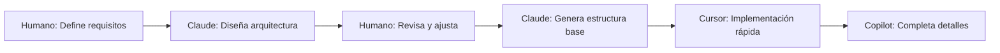

# 🤖 Guía de Colaboración IA+Humano para LiMeApp

## 🎯 Introducción

Esta guía establece las mejores prácticas para el desarrollo colaborativo entre humanos y asistentes de IA en el proyecto LiMeApp. Está optimizada para equipos hispanohablantes trabajando con Claude Code, Cursor, y GitHub Copilot.

## 🛠️ Herramientas y Especialización

### Claude Code (Terminal)

**Especialidad**: Arquitectura, debugging complejo, documentación

**Cuándo usar**:

-   🏗️ Diseño de arquitectura y refactoring mayor
-   🐛 Debugging sistemático de problemas complejos
-   📚 Generación de documentación comprehensiva
-   🧪 Estrategias de testing completas
-   🔍 Análisis profundo de código

**Ejemplo de prompt efectivo**:

```
Necesito refactorizar el sistema de plugins para soportar lazy loading.
Contexto: Actualmente todos los plugins se cargan al inicio.
Objetivo: Cargar plugins solo cuando el usuario accede a ellos.
Restricciones: Mantener compatibilidad con plugins existentes.
```

### Cursor (IDE)

**Especialidad**: Desarrollo rápido, refactoring inline, exploración

**Cuándo usar**:

-   ⚡ Desarrollo de componentes nuevos
-   🔄 Refactoring rápido con `Ctrl+K`
-   🎨 Implementación de UI/UX
-   📝 Documentación inline y comentarios
-   🔧 Fixes rápidos y mejoras iterativas

**Comandos clave**:

-   `Ctrl+K`: Generar código desde lenguaje natural
-   `Ctrl+L`: Chat contextual sobre el código
-   `Tab`: Aceptar sugerencias inline

### GitHub Copilot

**Especialidad**: Completado de código, boilerplate, tests

**Cuándo usar**:

-   🏃 Implementación rápida de funciones
-   🧪 Generación de casos de test
-   📋 Creación de boilerplate
-   🔤 Completado de tipos TypeScript

## 📋 Flujos de Trabajo Probados

### 1. Arquitectura-First (Claude Code)



**Ejemplo real**:

```bash
# Con Claude Code
"Diseña un sistema de notificaciones para LiMeApp que:
- Soporte múltiples proveedores (Firebase, WebPush)
- Sea extensible con nuevos providers
- Tenga retry logic y queue management
- Use el patrón de plugins existente"

# Claude genera arquitectura + tests
# Luego en Cursor implementas los componentes
```

### 2. TDD con IA

```javascript
// 1. Humano escribe test fallando
describe("NotificationService", () => {
    it("should queue notifications when offline", async () => {
        // Test vacío
    });
});

// 2. Claude/Cursor implementa para pasar el test
// 3. Copilot completa edge cases
```

### 3. Debug-Driven (Problema → Solución)

```bash
# Problema reportado
"Los usuarios reportan que el mapa no carga en móviles"

# Con Claude Code:
1. Análisis sistemático del problema
2. Hipótesis de causas posibles
3. Plan de debugging paso a paso
4. Implementación de fixes
5. Tests para prevenir regresión
```

## 🎨 Patrones de Prompts Efectivos

### Estructura CARE

-   **C**ontexto: Situación actual
-   **A**cción: Qué necesitas hacer
-   **R**esultado: Qué esperas obtener
-   **E**jemplos: Casos de uso o código similar

```
Contexto: Tenemos un componente MetricsPage que usa Redux
Acción: Migrar a React Query manteniendo la funcionalidad
Resultado: Mismo comportamiento pero con React Query
Ejemplo: Ver components/LocatePage.tsx que ya está migrado
```

### Prompts por Categoría

**🏗️ Arquitectura**:

```
"Diseña [sistema] que cumpla:
- Requisito 1
- Requisito 2
Considerando: [restricciones]
Similar a: [referencia existente]"
```

**🐛 Debugging**:

```
"Error: [mensaje de error]
Ocurre cuando: [pasos para reproducir]
Esperado: [comportamiento deseado]
Ya intenté: [soluciones probadas]"
```

**♻️ Refactoring**:

```
"Refactoriza [componente] para:
- Objetivo 1
- Objetivo 2
Mantén: [qué no debe cambiar]
Mejora: [qué optimizar]"
```

## 🔒 Seguridad y Mejores Prácticas

### ✅ Siempre Hacer

1. **Revisar código generado** - La IA puede introducir vulnerabilidades
2. **Validar imports** - Verificar que las librerías existen
3. **Correr tests** - Nunca confiar, siempre verificar
4. **Documentar decisiones** - Por qué se usó IA y qué se modificó

### ❌ Nunca Hacer

1. **Copiar ciegamente** - Siempre entender el código
2. **Compartir secretos** - Nunca en prompts
3. **Generar sin contexto** - Siempre dar contexto del proyecto
4. **Ignorar warnings** - La IA puede generar código deprecated

## 📊 Métricas de Efectividad

### Indicadores de Éxito

-   ⏱️ **Velocidad**: 3-5x más rápido en tareas rutinarias
-   🎯 **Precisión**: 90%+ en código que pasa tests
-   📚 **Documentación**: 100% de cobertura alcanzable
-   🐛 **Bugs**: -40% con revisión IA de PRs

### Antipatrones Detectados

1. **IA-dependencia**: No poder codear sin IA
2. **Over-engineering**: IA sugiere soluciones muy complejas
3. **Context overflow**: Prompts muy largos y confusos
4. **Copy-paste ciego**: No entender el código generado

## 🎯 Casos de Uso Específicos LiMeApp

### Desarrollo de Plugins

```javascript
// Prompt efectivo para nuevo plugin
"Crea un plugin lime-plugin-[nombre] que:
1. Siga la estructura en devTools/plugins.js
2. Use React Query para data fetching
3. Incluya tests con mock de ubus
4. Tenga stories de Storybook
Ver lime-plugin-metrics como referencia"
```

### Integración con ubus

```javascript
// La IA necesita contexto sobre ubus
"ubus es el sistema de RPC de OpenWrt. En LiMeApp:
- Usamos utils/uhttpd.service.js como cliente
- Los calls son JSON-RPC a /ubus
- Necesita session_id para autenticación
Implementa [función] siguiendo este patrón"
```

### Testing con LibreMesh

```bash
# Contexto importante para IA
"Tests deben considerar:
- Router puede no responder (offline)
- Datos pueden ser null/undefined
- ubus puede retornar errores
- Usar mocks de utils/test_utils.js"
```

## 🚀 Workflow Completo Ejemplo

### Tarea: Agregar soporte para notificaciones push

```bash
# 1. Arquitectura con Claude Code
"Diseña sistema de notificaciones push para LiMeApp considerando:
- Integración con service workers existente
- Soporte offline con queue
- Compatibilidad con Firebase y WebPush
- UI en settings para habilitar/deshabilitar"

# 2. Claude genera:
# - Arquitectura completa
# - Interfaces TypeScript
# - Plan de implementación
# - Tests base

# 3. En Cursor - Implementación rápida
Ctrl+K: "implementa NotificationService siguiendo la interfaz definida"

# 4. GitHub Copilot completa:
# - Casos edge en funciones
# - Tests adicionales
# - Documentación JSDoc

# 5. Claude Code - Review final
"Revisa la implementación de notificaciones:
[pegar código]
Busca: problemas de seguridad, performance, mejores prácticas"
```

## 📝 Plantillas de Documentación

### Para PRs con IA-assistance

```markdown
## Descripción

[Qué hace este PR]

## IA-Assistance

🤖 Claude Code: Arquitectura y estrategia de testing
🤖 Cursor: Implementación de componentes
🤖 Copilot: Completado de utilidades

## Cambios

-   [ ] Feature/Fix implementado
-   [ ] Tests agregados/actualizados
-   [ ] Documentación actualizada

## Testing

[Cómo se probó]
```

## 🔄 Retroalimentación y Mejora

### Compartir Aprendizajes

1. Documenta prompts exitosos en `PLANTILLAS_PROMPTS.md`
2. Comparte patrones que funcionan en reuniones
3. Actualiza esta guía con nuevos descubrimientos

### Métricas de seguimiento

-   Tiempo de desarrollo por feature
-   Bugs introducidos vs detectados por IA
-   Cobertura de tests alcanzada
-   Satisfacción del equipo

---

_"La IA es un copiloto, no un piloto automático."_ — Equipo LiMeApp
